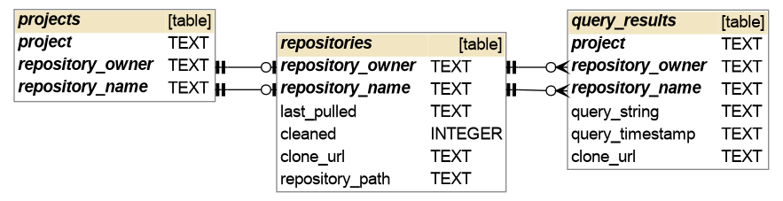

# Tools for managing a local database of github project

> A local database of github repositories

Tools for creating, curating and maintaining a database of github repositories
in a local sqlite database.

## Installing

```shell
python -m pip install git+https://github.com/sellisd/gitrepodb.git  
```

## Getting started

```shell
gitrepodb init # initialize database
gitrepodb query --head 10 --project python # query github for top 10 python repositories
gitrepodb add # add query results to database
gitrepodb download --project python # clone repositories in database
```

With the above commands we create a database with the following schema: 

(schema image generated by [schemacrawler](https://www.schemacrawler.com/))
### Initial Configuration

Querying GitHub is performed with the github API. The API limits the number of request per time, to profit from higher limits you can use a personal token to authenticate. To do so create a personal access token ([see instructions](https://docs.github.com/en/free-pro-team@latest/github/authenticating-to-github/creating-a-personal-access-token)) and save it in an `.env` file readable by [dotenv](https://github.com/theskumar/python-dotenv).

## Developing

To develop it is easier to clone and install editable:

```shell
python -m pip install -e git+https://github.com/sellisd/gitrepodb.git
```

## Features

* Create a local sqlite database and clone github repositories
* Sync the database and repositories to github
